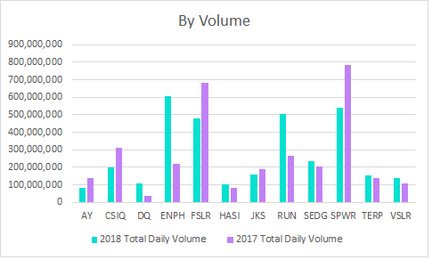
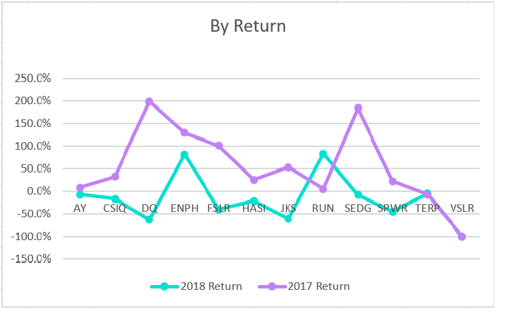

# stock-analysis
For VBA

# Refactor VBA code and measure performance

## Overview of Project

The puprpose of this project is to analyze some of the stocks - how they faired in years 2017 and 2018. For this we can calculate 2 things
1). Yearly Volume - sum all of the daily volume for each stock
2). Yearly Return - the percentage increase or decrease in price from          	the beginning of the year to the end of the year.

For these purposes, we will "refactor" the code we already have for one of the stock ticker - DQ. We will reuse this code for all the 12 stock/tickers, and calculate the yearly volumes and returns.

### Analysis

From the following bar chart, which is by Total Volume of the stocks, we can see that, for most of the part 2017 was a better year.

 
Same can be seen if we look at the line chart which is by the Yearly Retun

### Summary

## Detailed statement on the advantages and disadvantages of refactoring code in general

The main purpose of code refactoring is pretty clear — to make the code clean, neat, more efficient and maintainable. This process means a kind of software upgrade necessary to improve several non-functional features: maintainability, performance, security, and scalability.
However, in certain scenarios it is better NOT to refactor your code.
1. The code is in production (that is, it's either past beta, or it's in active use on production infrastructure).
2. There are no existing bugs that would be solved by refactoring the code.
3. There are no new features that would be significantly simpler to implement following a refactor.
4. The code meets all required coding standards for the project.
5. There are no security-related anti-patterns present in the code.
6. You are not the primary maintainer of the code in question.
7. The code cannot be refactored without changing the API exposed to other components of the software.

Here are some advantages and disadvantages

## Detailed statement on the advantages and disadvantages of the original and refactored VBA script 
  In the original script we were dealing with only one stock/ticker, so we can use the hardcoded indexes. But when we refactored the same code, we were able to 
get the same results for 11 more (total of 12) stocks/tickers, and that too in a shorter amount of time. Had we used the same methods as in the original script, it would have taken a lot more time, maybe 10x more.

However, since we used variables instead of hardcoded indexes, it takes someone more time to understand the code.

